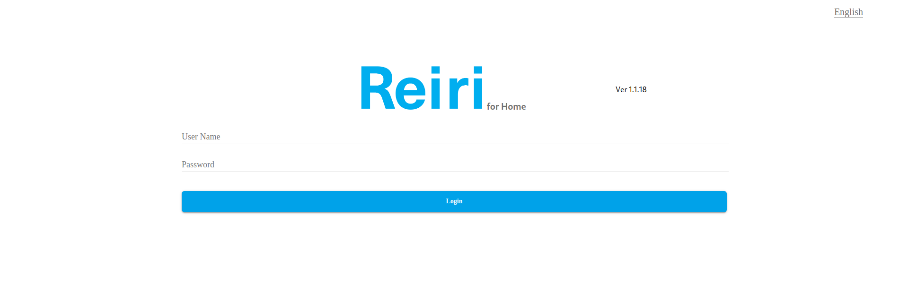
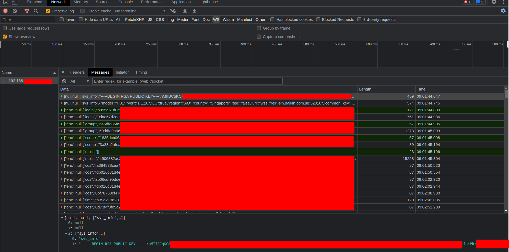
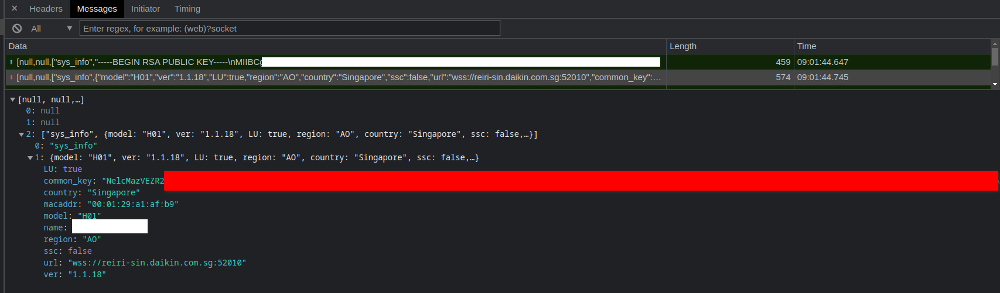

# Reiri Daikin Websocket Inspector

## About
Reiri is an air conditioner (AC) controller by Daikin. The controller can be accessed via web interface such as this login page below:


Reiri have features to manage multiple air conditioners, such as turning them on/off, setting temperatures/fan speed/etc. 
But unfortunately, Reiri did not provide any API to programatically access them. 
Instead they only provide a web application (react+websocket) to interface with the controller. 

After some quick inspection on Chrome's devtools, the communication protocol is revealed to be as such:



In summary, their communication protocol 'reinvents the wheel' of SSL encryption: client send public key, server reply with a common key encrypted with the provided public key, then client decrypt it with client's private key, then the rest of the communication is encrypted with the agreed key. 

This project aims to help inspecting/sniffing the traffic between your own browser and Reiri Daikin controller. 

This tool is written because author wants to know what communication happens between client (browser/javascript/react) and websocket server (black box). Author needs to know it in order to made an integrated API controlling those AC units programatically (not via user action in browser, but via Linux system call/bash script instead). 

## Disclaimer
- Author is not responsible for any kind of attack that may happen because of this tool, use it at your own responsibility. 
- This tool can only decrypt/sniff traffic between YOUR OWN computer and Reiri Daikin's websocket, so this tool does not exploit any vulnerability (and only use Chrome's devtools). 
- This tool have only been tested on Reiri controller version 1.1.18 model H01 (Singapore). It may or may not work on other version/model/country, contribution on testing/compatibility is appreciated. 

## Requirement
- Node.js
- package npm 'node-rsa'
- package npm 'crypto'
- package npm 'fs'

You can use provided node_modules or install it yourself with `npm install` command

## Usage
```node reiri.js /path/to/private-key.pem /path/to/common_key encrypt/decrypt/generate plaintext/ciphertext/keylength```
There is 3 mode: encrypt/decrypt/generate

#### Encrypt
- usage: ```node reiri.js /path/to/private-key.pem /path/to/common_key encrypt plaintext```
- example: ```node reiri.js /path/to/private-key.pem /path/to/common_key encrypt '{"name":"user","passwd":"pass"}'```
- to get content of private key, open Chrome's devtools > console > type ```console.log(window.localStorage.getItem('private_key'));``` > enter
- to get content of common_key, open Chrome's devtools > network > WS (websocket) > click first entry > click on "sys_info" received > seek on "common_key" (see screenshot above)
- output in STDOUT is the encrypted text (ciphertext)

#### Decrypt
- usage: ```node reiri.js /path/to/private-key.pem /path/to/common_key decrypt ciphertext```
- example: ```node reiri.js /path/to/private-key.pem /path/to/common_key decrypt 4d73a4a1297794ef2d9c982cfc36812e50d4647d1e8996d95761e488e832d7ee16b5f6a0f2fcdd42857470b9f39645b356101f41407538f3c36269141c83367df817979f9556f7c37fc319b6529bfb0f9087f447ef1109b52750df61e7b1bce8d9d7b8ce7d11d1b7fbcb3ca0454369b48b9643d213228e633f6f468d2e13eb86410109c90a9e17f11fa7019cba6f4be753ccda7ca5eb1ca8e901edfcfa99751c153f868f05cfa37aac34959c7ecb42dfca6ae97638d2c2f8ab0f27529b149209242564fb72c21a152d6fe1bde474377e8d2507eefcd66ebedc435bee8b7c9e249d92e496c242a73777dd6bf443a75c4e3f62382b3b47afbd86cbf85629d9758f5129fa2808c0174fe17c208f12b90ded42cd6d1d28fd95054b5a91a99e8aab4ebd1a00e3f088e7ceeb7736ea3e72cc0701ccdc4ff96c9db49b366d008694528ed531b3698445f19b558ae1d39669bc30a3c73baceecbdfd75cb47168268488ede5dae38cf688a57214c47a7ed618b847```
- output in STDOUT is the decrypted text (plaintext)

#### Encrypt
- usage: ```node reiri.js /path/to/private-key.pem /path/to/common_key generate keylength```
- example: ```node reiri.js /path/to/private-key.pem /path/to/public-key.pem generate 2048```
- generated key content will be written to ```/path/to/private-key.pem``` and ```/path/to/public-key.pem```
- ```keylength``` argument is mandatory
- output in STDOUT is empty
